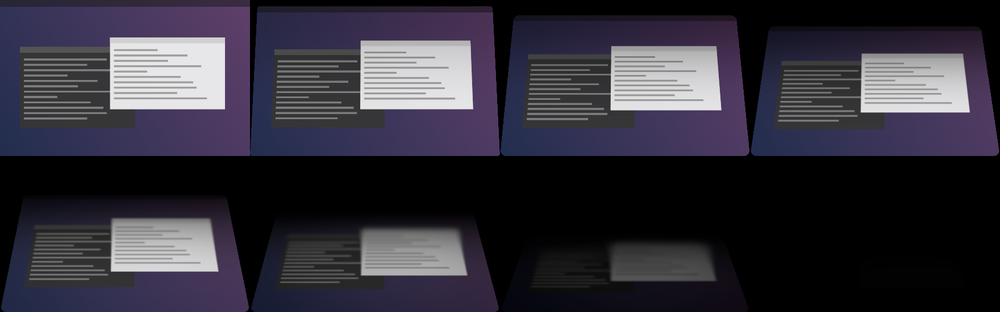
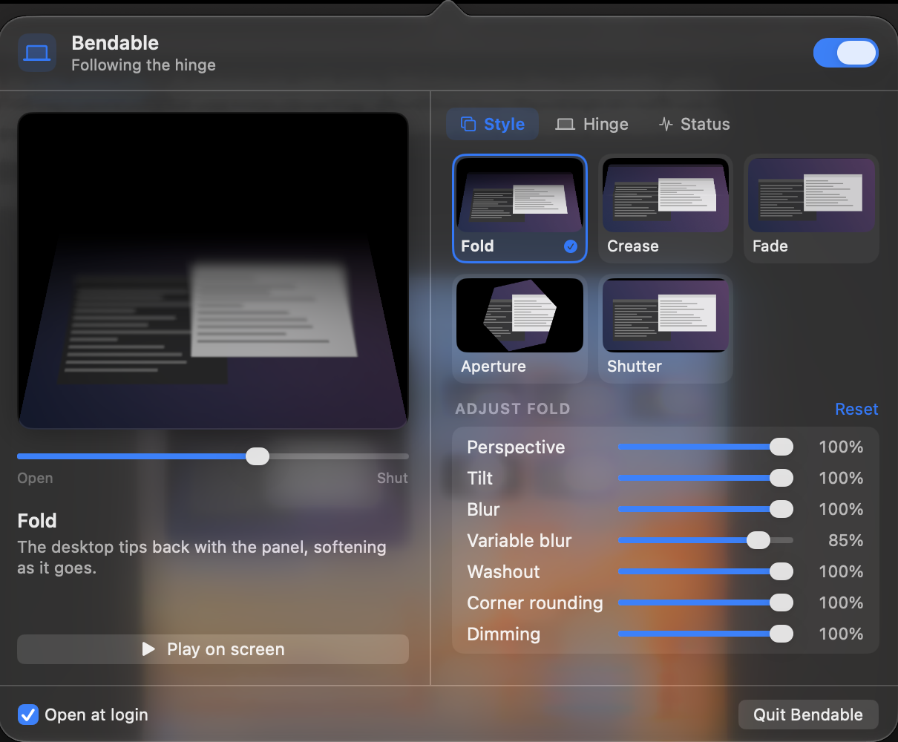

# Bendable

Bendable turns the physical movement of a MacBook lid into an animation on the
built-in display. On Macs with a lid angle sensor it tracks the hinge continuously:
move the display slowly with your hand and the desktop folds with it, in both
directions.

It lives in the menu bar, does nothing while the lid is parked, and never touches the
network.

## What it looks like



Fold, sampled at eight points between resting open and shut. Those are real frames:
`scripts/render-sheet.sh fold` runs the shipping preset through the shipping shader,
so the sheet cannot drift away from what the lid does.

<!-- A moving demo has to be filmed with a phone. A screen recording cannot show the
     lid and the display at the same time, which is the whole point. -->

## Requirements

macOS 14 or later, on any Mac with a built-in display. Continuous tracking needs a
Mac that publishes a lid angle sensor; see the table below.

## Installing

Download `Bendable.dmg` from the [releases page](../../releases), open it, and drag
Bendable to Applications.

Builds are ad-hoc signed rather than notarized, so the first launch is blocked and
macOS says it "cannot be opened because Apple cannot check it for malicious software".
Two ways past it.

**In the interface.** Try to open Bendable and dismiss the warning. Then go to System
Settings, Privacy & Security, scroll to Security, and click **Open Anyway** next to the
message about Bendable. Confirm, and it opens from then on.

Control-clicking the app and choosing Open does not work for this. That route was how
it used to be done, and macOS 15 removed it; Open Anyway is the replacement.

**In a terminal**, which works on every version:

```bash
xattr -dr com.apple.quarantine /Applications/Bendable.app
```

Bendable has no Dock icon and opens no window: it is the small laptop in the menu bar.
If nothing appears to happen when you launch it, look up there before assuming it
failed.

Releases are signed and notarized, and open without any of this, when the maintainer's
signing secrets are configured.

## How the lid is tracked

Bendable asks the machine what it can report and adapts. There are three cases:

| Capability | What it means | What you get |
| --- | --- | --- |
| `continuousAngle` | A lid angle sensor is present | The animation is scrubbed by the hinge in real time |
| `lidStateOnly` | Only open and closed edges are visible | The animation plays on a short timeline instead |
| `unsupported` | No built-in lid | Animations are available in the preview only |

Whichever applies is shown at the top of the menu bar popover.

### Which Macs have the sensor

| Mac | Continuous angle |
| --- | --- |
| MacBook Air (M2 and later) | Yes |
| MacBook Pro (M2 and later) | Yes |
| MacBook Air / Pro (M1) | Usually; check under Status in the popover |
| Intel MacBooks | No, falls back to open and close events |
| Mac mini, Studio, Pro, iMac | Not applicable |

This table is built from the machines the project has run on. If yours disagrees, the
Status tab shows the raw reading and the detected capability, and an issue
saying what it reports would be welcome.

Nothing about this is privileged: no kernel extension, no privileged helper, no
daemon, no entitlement, and SIP stays on. The one exception is the lid-shut
wakefulness switch below, which asks for your password each time it is used and
installs nothing. [docs/HARDWARE.md](docs/HARDWARE.md) has the
details, including why the sensor is polled rather than subscribed to.

### Without a sensor

Bendable listens for `kIOPMMessageClamshellStateChange` on `IOPMrootDomain`, which
gives open and closed edges with no polling. The animation then runs on a short
timeline rather than tracking the hinge. Nothing above the hinge layer changes: the
state machine, the presets and the renderer cannot tell the difference.

## Permissions

Bendable asks for nothing at launch.

**Screen Recording** is requested only if you pick a style that redraws your desktop,
and only when you press Allow. It is used for a single still captured as the lid
starts to move, never a continuous stream. Every other style works without it.

> Fold and Crease show as a plain fade without that permission. Bendable falls back
> rather than rendering an empty panel, and says so in the popover when it happens.
> macOS only checks the permission when a process launches, so Bendable needs
> restarting once you have allowed it. There is a button for that in the same place.

**Launch at login** registers the app itself through `SMAppService`. Nothing is
installed.

## Interface

Everything is in one menu bar popover. There is no settings window.



The preview sits permanently on the left, so a slider and what it does to the picture
are visible at the same time. Drag under it to move the hinge by hand, or play the
whole thing full screen. It goes through the same engine and the same shader the lid
drives, so it is not a mock-up of the effect.

The controls are on the right, in three tabs:

* **Style** picks the animation from live thumbnails, rendered by the real preset
  through the real shader, and holds the sliders for whatever that style responds to.
  They are stored per style, so switching back and forth keeps each one's settings.
  Double-click a slider's name to put that one back.
* **Hinge** covers whether closing and opening animate, their strengths, smoothing,
  and the start angle: how far down the lid comes before the effect really begins.
  A travel map underneath shows that band against your own hinge, with the live angle
  riding on it.
* **Status** is the sensor, your learned calibration and the permissions, with a
  button that copies the lot for a bug report.

## Staying awake with the lid shut

Under **Hinge** there is a switch that turns off lid-close sleep, so a build, a
download or a render carries on with the lid down.

macOS asks for your password when you use it, in both directions. That is not Bendable
being careful for the sake of it: no public API can keep a Mac awake through a lid
close, so the only way to do it is `pmset disablesleep`, which is a system setting.
Bendable installs no helper and no daemon to avoid asking, so it has to ask.

Three things worth knowing, all of which the app says too:

* It keeps running and keeps making heat. Fine on a desk, not in a closed bag.
* It outlives Bendable. Quitting does not restore normal sleep, because restoring it
  needs your password as well. Bendable offers to do that when you quit.
* It is a system-wide setting, so another app or a Terminal command can change it.
  Bendable reads the real state rather than assuming, and says so when something else
  turned it on.

To undo it without Bendable:

```bash
sudo pmset -a disablesleep 0
```

## Styles

| Style | Needs Screen Recording | What it does |
| --- | --- | --- |
| **Fold** | Yes | The desktop turns against the lid, degree for degree, so it appears to stand still while the machine folds away under it |
| **Crease** | Yes | A book fold: the desktop creases across its middle and only the upper half rotates away, with a bowed crease and a highlight catching the bend |
| **Curl** | Yes | The top edge rolls over and away on a soft bend, the way a sheet of paper lifts off a desk |
| **Recede** | Yes | The desktop drops straight back into the dark, square to you the whole way, with no rotation at all |
| **Slide** | Yes | The desktop slides down out of sight behind the hinge, accelerating as it goes |
| **Fade** | No | A plain dim to black |
| **Aperture** | No | Iris blades close over the screen |
| **Shutter** | No | Bars close in from the top and bottom |
| **Blinds** | No | Six slats close down the screen, each shutting from its own edges inward |

Presets are pure functions from hinge state to a frame description. Adding one is
about forty lines and does not touch the sensor pipeline; see
[ARCHITECTURE.md](ARCHITECTURE.md).

If Reduce Motion is on, every spatial style is replaced by a gentle fade with no
movement and no flashing.

## Privacy

Lid angles, lid events, calibration and usage never leave your Mac.

There is no analytics, telemetry, crash reporting, remote configuration, account,
identifier or backend. Bendable makes no network requests, and its entitlements file
grants no network access, so it works identically with networking off. CI fails the
build if a network entitlement ever appears in the signed app.

The only stored data is a small set of preferences and a learned hinge range, in
Bendable's own `UserDefaults` domain. [PRIVACY.md](PRIVACY.md) lists every key.

Captured stills are held in GPU memory for the duration of one lid movement, are never
written to disk, and are discarded before the Mac sleeps and whenever the screen locks.

## Building

```bash
xcodebuild -project Bendable.xcodeproj -scheme Bendable -configuration Release build
```

Or use the scripts, which put the result somewhere predictable:

```bash
scripts/test.sh
scripts/build.sh          # -> build/Bendable.app
scripts/run.sh            # build, install to /Applications and restart it
scripts/package-dmg.sh    # -> build/releases/Bendable.dmg
```

Code signing needs a filesystem with extended attributes. If your checkout is on exFAT
or a network share, point the build elsewhere:

```bash
DERIVED_DATA=/tmp/bendable-build OUTPUT_DIR=/tmp/bendable scripts/build.sh
```

Debug builds add a Developer section to the popover with a hinge simulator, power
event injection and live readouts, plus three commands for working without a laptop to
hand:

```bash
Bendable --render-sheet fold out.png   # a style across its whole travel
Bendable --render-ui out.png style     # one tab of the popover, laid out and captured
Bendable --trace-close 2               # a simulated close, measured
```

`scripts/make-icon.sh` redraws the app icon and recuts every size in the asset
catalogue. The artwork is code, not a binary.

## Releasing

Bump `MARKETING_VERSION` in the Xcode project and push to `main`. That is the whole
procedure.

The release workflow reads the version out of the project, and if no tag matches it
yet, tests, builds, packages a DMG with a SHA-256 checksum, tags the commit and
publishes a GitHub release with both attached. Pushing a `v*` tag by hand still works
and does the same thing.

The version lives in one place, so there is no way to ship a release whose number
disagrees with what the app reports about itself. `scripts/version.sh` prints it.

Pushes to `main` that do not change the version cost one short Linux job that reads
the version and stops. Nothing is built and nothing is published.

Signing and notarization happen only if these optional repository secrets are set.
Without them the workflow still produces a working ad-hoc signed DMG.

| Secret | Purpose |
| --- | --- |
| `MACOS_CERTIFICATE` | Base64 of a Developer ID Application `.p12` |
| `MACOS_CERTIFICATE_PASSWORD` | Password for that `.p12` |
| `MACOS_SIGNING_IDENTITY` | e.g. `Developer ID Application: Name (TEAMID)` |
| `NOTARY_APPLE_ID` | Apple ID for `notarytool` |
| `NOTARY_PASSWORD` | App-specific password |
| `NOTARY_TEAM_ID` | Team identifier |

Every push and pull request also builds, tests and uploads a DMG as a workflow
artifact, so any commit has a downloadable build.

## Contributing

See [CONTRIBUTING.md](CONTRIBUTING.md).

## License

MIT. See [LICENSE](LICENSE).
